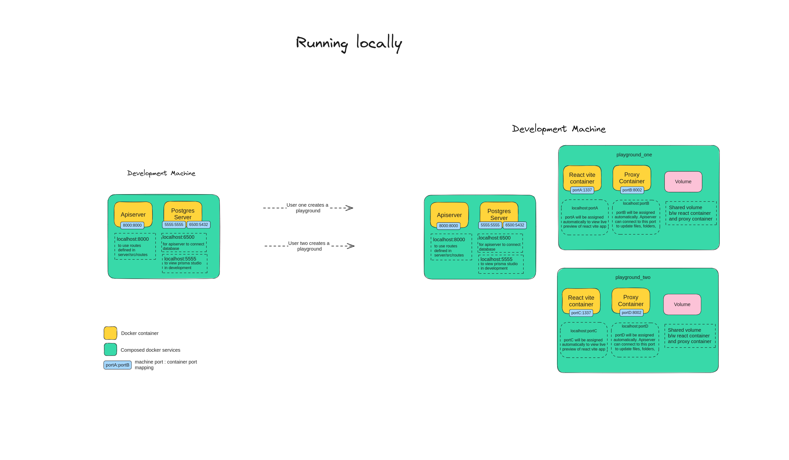
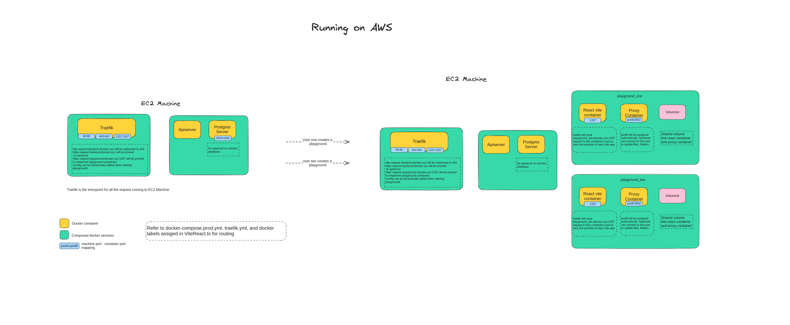

# icodeit

This is a fullstack project by [CJ](github.com/dev-cj).

* icodeit provides isolated coding environment for users
* coding environment can be accessed through playground page
* playground page features
    * file explorer
    * iterm based terminal connected to container
    * code editor based on monaco editor
    * browser panel to view live preview

## Running locally

## Running on AWS

## Tech stack

### Frontend
* Nextjs
* Monaco editor
* allotment
* iterm
* tailwind
* typescript
* socket.io

### Backend
* Treafik
* dockerode
* express
* prisma
* typescript
* socket.io
