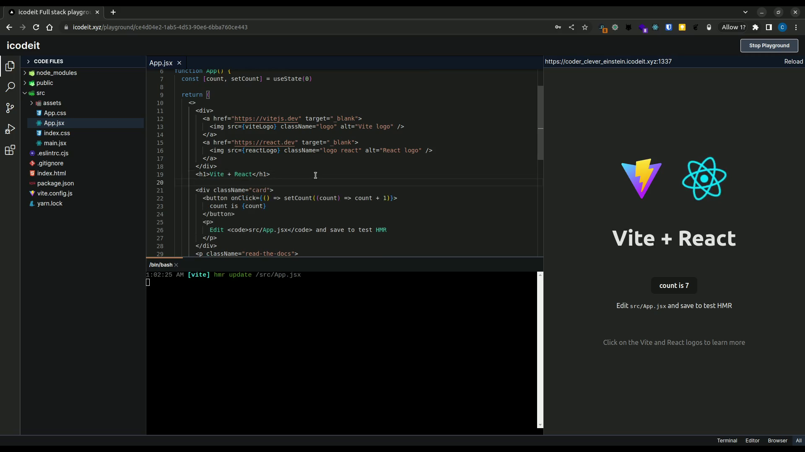

# icodeit

This is a fullstack project by [CJ](github.com/dev-cj).

* icodeit provides isolated coding environment for users
* coding environment can be accessed through playground page
* playground page features
    * file explorer
    * iterm based terminal connected to container
    * code editor based on monaco editor
    * browser panel to view live preview

## icodeit in action

[Watch video](https://res.cloudinary.com/di7l26baz/video/upload/v1692127509/github/icodeit/icodeit_in_action_cs4evx.mp4)

## Running locally

## Running on AWS

## Tech stack

### Frontend
* Nextjs
* Monaco editor
* allotment
* iterm
* tailwind
* typescript
* socket.io

### Backend
* Treafik
* dockerode
* express
* prisma
* typescript
* socket.io

## Run icodeit

1. Star this repo
2. Start server. Read instructions in server folder.
3. Start frontend. Read instruction in frontend folder.
